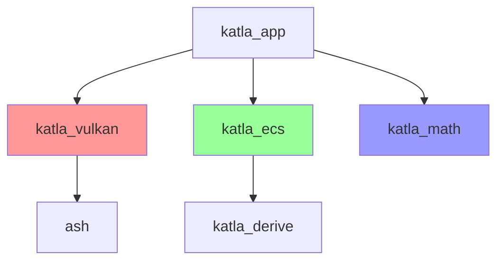

# Katla Architecture Validator

## Overview

This skill enforces critical architecture rules in the Katla project to maintain clean module boundaries and prevent circular dependencies.

## Critical Architecture Rules

### 1. Dependency Restrictions (Enforced Boundaries)

**CRITICAL**: These restrictions maintain clean module boundaries.

```
katla_vulkan must NOT depend on: katla_math, katla_ecs, katla_app
katla_ecs must NOT depend on: katla_app, katla_vulkan, katla_math
katla_math must NOT depend on: katla_app, katla_vulkan, katla_ecs
katla_app can depend on: katla_vulkan, katla_ecs, katla_math
```

### 2. Ash Type Exclusion Rule

**CRITICAL**: `katla_vulkan` crate must NOT export or re-export `ash::vk` types in its public API.

- Create wrapper types for all Vulkan types
- Use type aliases internally if needed, but never `pub use ash::vk`
- Downstream crates (katla_app) should NOT need to depend on ash directly

## Validation Commands

### Dependency Check

```bash
# Check katla_vulkan dependencies (should NOT include katla_math, katla_ecs, katla_app)
grep -A 20 "^\[dependencies\]" katla_vulkan/Cargo.toml | grep -E "katla_(math|ecs|app)"

# Check katla_ecs dependencies (should NOT include katla_app, katla_vulkan, katla_math)
grep -A 20 "^\[dependencies\]" katla_ecs/Cargo.toml | grep -E "katla_(app|vulkan|math)"

# Check katla_math dependencies (should NOT include katla_app, katla_vulkan, katla_ecs)
grep -A 20 "^\[dependencies\]" katla_math/Cargo.toml | grep -E "katla_(app|vulkan|ecs)"
```

### Ash Type Exclusion Check

```bash
# Check for public ash::vk re-exports in katla_vulkan
grep -rn "pub use ash::vk" katla_vulkan/src/

# Check for ash::vk types in public function signatures
grep -rn "pub fn.*vk::" katla_vulkan/src/

# Check for ash::vk types in public struct fields
grep -rn "pub struct" katla_vulkan/src/ -A 10 | grep "vk::"

# Check for ash::vk types in public enums
grep -rn "pub enum" katla_vulkan/src/ -A 10 | grep "vk::"
```

### Import Dependency Check

```bash
# Check katla_vulkan imports (should not have katla_math, katla_ecs, katla_app)
grep -rn "^use katla_" katla_vulkan/src/ | \
  grep -E "use katla_(math|ecs|app)::"

# Check katla_ecs imports (should not have katla_app, katla_vulkan, katla_math)
grep -rn "^use katla_" katla_ecs/src/ | \
  grep -E "use katla_(app|vulkan|math)::"

# Check katla_math imports (should not have katla_app, katla_vulkan, katla_ecs)
grep -rn "^use katla_" katla_math/src/ | \
  grep -E "use katla_(app|vulkan|ecs)::"
```

## Common Architecture Violations

### Violation 1: Direct Ash Type in Public API

**WRONG:**
```rust
// In katla_vulkan/src/lib.rs or public module
pub fn create_image(format: vk::Format) -> Result<vk::Image> {
    // ...
}
```

**CORRECT:**
```rust
// Use wrapper types from render_graph/types.rs
pub fn create_image(format: ImageFormat) -> Result<ImageHandle> {
    // Convert internally
    let vk_format = ash::vk::Format::from(format);
    // ...
}
```

**Wrapper Type Location:**
- `katla_vulkan/src/render_graph/types.rs` - ImageFormat, ImageLayout, Extent2D/3D
- `katla_vulkan/src/vulkan/vertexbuffer.rs` - IndexType

### Violation 2: Forbidden Dependencies

**WRONG:**
```toml
# In katla_vulkan/Cargo.toml
[dependencies]
katla_math = { path = "../katla_math" }  # VIOLATION!
```

**SOLUTION:**
- If katla_vulkan needs math types, define them locally or use simple types
- Consider if the dependency is really necessary
- Move shared types to a separate crate if truly needed (e.g., katla_core)

### Violation 3: Internal Types Leaked in Public API

**WRONG:**
```rust
// Internal ash type in public struct
pub struct Texture {
    pub image: vk::Image,  # Leaks internal type
    pub view: vk::ImageView,  # Leaks internal type
}
```

**CORRECT:**
```rust
// Wrap internal types
pub struct Texture {
    image: Image,  # Internal wrapper
    view: ImageView,  # Internal wrapper
}

// Or use opaque handle
pub struct Texture {
    handle: TextureHandle,  # Newtype wrapper around internal ID
}
```

## Module Boundary Validation

### Public API Audit

```bash
# Find all public items in katla_vulkan
grep -rn "^pub " katla_vulkan/src/ | \
  grep -E "pub fn|pub struct|pub enum|pub type|pub mod"

# Verify none expose ash::vk types
# For each public item, check signature doesn't include vk::
```

### Internal API Check

```bash
# Items marked pub(crate) are OK to use ash types
grep -rn "pub(crate)" katla_vulkan/src/ | \
  wc -l

# But pub items should not
grep -rn "^pub " katla_vulkan/src/ | \
  grep "vk::"
# Should return 0 results
```

## Wrapper Type Pattern

### Creating New Wrapper Types

When you need to expose Vulkan functionality:

1. **Define wrapper enum/struct** in appropriate module:
```rust
// In render_graph/types.rs or dedicated type module
#[derive(Debug, Clone, Copy, PartialEq, Eq)]
pub enum SampleCount {
    Sample1 = 1,
    Sample4 = 4,
    Sample8 = 8,
}

impl From<SampleCount> for ash::vk::SampleCountFlagBits {
    fn from(value: SampleCount) -> Self {
        match value {
            SampleCount::Sample1 => Self::TYPE_1,
            SampleCount::Sample4 => Self::TYPE_4,
            SampleCount::Sample8 => Self::TYPE_8,
        }
    }
}

impl From<ash::vk::SampleCountFlagBits> for SampleCount {
    fn from(value: ash::vk::SampleCountFlagBits) -> Self {
        match value {
            ash::vk::SampleCountFlagBits::TYPE_1 => SampleCount::Sample1,
            ash::vk::SampleCountFlagBits::TYPE_4 => SampleCount::Sample4,
            ash::vk::SampleCountFlagBits::TYPE_8 => SampleCount::Sample8,
            _ => SampleCount::Sample1,
        }
    }
}
```

2. **Use wrapper in public API**:
```rust
// In katla_vulkan public API
pub fn create_framebuffer(
    &self,
    samples: SampleCount,  # Wrapper type, not vk::SampleCountFlagBits
) -> Result<Framebuffer> {
    let vk_samples = ash::vk::SampleCountFlagBits::from(samples);
    // Use vk_samples internally
}
```

3. **Never pub use ash::vk**:
```bash
# This should never appear in katla_vulkan
# pub use ash::vk as vk;  # DON'T DO THIS
```

## Existing Wrapper Types Reference

### Render Graph Types (`katla_vulkan/src/render_graph/types.rs`)

These wrapper types are already defined and should be used:

- **ImageFormat**: R8G8B8A8Srgb, R32Sfloat, D32Sfloat, etc.
- **ImageLayout**: Undefined, General, ColorAttachmentOptimal, etc.
- **ImageUsage**: TransferSrc, TransferDst, Sampled, ColorAttachment, etc.
- **ImageTiling**: Optimal, Linear
- **Extent2D**: { width, height }
- **Extent3D**: { width, height, depth }
- **SampleCount**: Sample1, Sample4, Sample8
- **Filter**: Nearest, Linear
- **SamplerMipmapMode**: Nearest, Linear
- **SamplerAddressMode**: Repeat, MirroredRepeat, ClampToEdge, etc.

### Vulkan Wrapper Types

- **IndexType** (`katla_vulkan/src/vulkan/vertexbuffer.rs`): UInt16, UInt32

## Code Review Checklist

When reviewing architectural changes:

### Dependencies
- [ ] No forbidden dependencies in Cargo.toml
- [ ] katla_vulkan doesn't depend on katla_math, katla_ecs, katla_app
- [ ] katla_ecs doesn't depend on katla_app, katla_vulkan, katla_math
- [ ] katla_math doesn't depend on katla_app, katla_vulkan, katla_ecs

### Public API
- [ ] No `pub use ash::vk` in katla_vulkan
- [ ] No `vk::` types in public function signatures
- [ ] No `vk::` types in public struct/enum fields
- [ ] All wrapper types implement `From<Wrapper> for vk::Type` and `From<vk::Type> for Wrapper`

### Module Organization
- [ ] Internal types use `pub(crate)` not `pub`
- [ ] Wrapper types placed in appropriate modules
- [ ] No circular imports between modules

### Build Verification
- [ ] `cargo build -p katla_vulkan` succeeds
- [ ] `cargo build -p katla_app` succeeds without ash dependency
- [ ] `cargo clippy` passes without warnings

## Fixing Architecture Violations

### Step 1: Identify the Violation

```bash
# Find public APIs using ash types
grep -rn "^pub fn.*vk::\|^pub struct.*vk::" katla_vulkan/src/
```

### Step 2: Create Wrapper Type

Add appropriate wrapper type to `render_graph/types.rs` or local module.

### Step 3: Update API

Replace `vk::Type` with wrapper type in public API, convert internally.

### Step 4: Test

```bash
cargo build -p katla_vulkan
cargo build -p katla_app  # Should not need ash
cargo test
```

## Dependency Graph Visualization



**Red edges are FORBIDDEN:**
- katla_vulkan → katla_math ❌
- katla_vulkan → katla_ecs ❌
- katla_vulkan → katla_app ❌
- katla_ecs → katla_vulkan ❌
- katla_ecs → katla_math ❌
- katla_ecs → katla_app ❌
- katla_math → any other katla crate ❌

## Pre-Commit Hook

Consider adding a pre-commit hook to validate architecture:

```bash
# .git/hooks/pre-commit
#!/bin/bash

# Check for forbidden dependencies
if grep -q "katla_math" katla_vulkan/Cargo.toml; then
    echo "ERROR: katla_vulkan depends on katla_math (forbidden)"
    exit 1
fi

# Check for ash type leaks in public API
if grep -rn "pub use ash::vk" katla_vulkan/src/; then
    echo "ERROR: Found 'pub use ash::vk' in katla_vulkan"
    exit 1
fi

echo "Architecture validation passed"
```

## Resources

- `CLAUDE.md` - Project architecture documentation
- `katla_vulkan/src/render_graph/types.rs` - Wrapper type examples
- `katla_vulkan/src/vulkan/vertexbuffer.rs` - IndexType wrapper example
