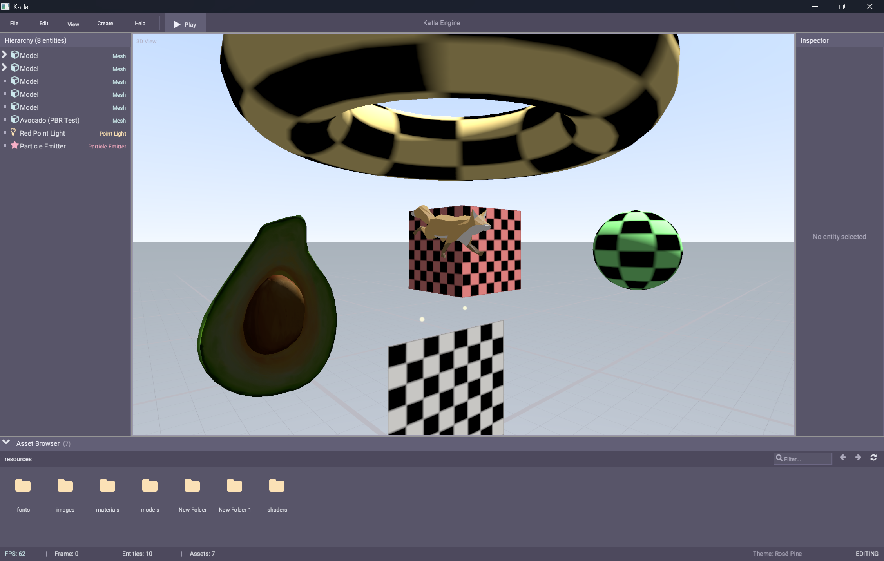

# Katla ✨🎮



A Vulkan game engine in Rust. Playground for graphics experiments. 🐒

## What's Inside 📦

- **Vulkan 1.3** 🔺 - Dynamic rendering, Synchronization2, VMA integration
- **Custom ECS** 🧩 - Sparse set storage, query system, component derive macros
- **Render graph** 📊 - Resource lifetime management, automatic barrier insertion
- **PBR materials** 💎 - Hot reload support, template-based definitions
- **WGSL shaders** ✨ - Compiled via naga at runtime
- **GLTF support** 🦊 - Skeletal animation, PBR materials, background loading
- **Editor UI** 🖼️ - Asset browser, entity inspector, transform gizmos

## Crates 📚

| Crate | Description |
|-------|-------------|
| `katla_gfx` | Vulkan wrapper, render graph, materials |
| `katla_ecs` | Entity component system |
| `katla_math` | SIMD math library |
| `katla_ui` | Immediate mode UI system |
| `katla_app` | Application framework, components, systems |

## Running 🏃

```bash
cargo run        # Run the demo 🎮
cargo run -- -s  # Limited frames (validation) ✅
cargo test       # Run tests 🧪
```

## Is this vibecoded? 🤖
**It sure is, I ain't got time to write all of this**  
This repo has become my playground for vibecoding to see how good or bad it can be.
