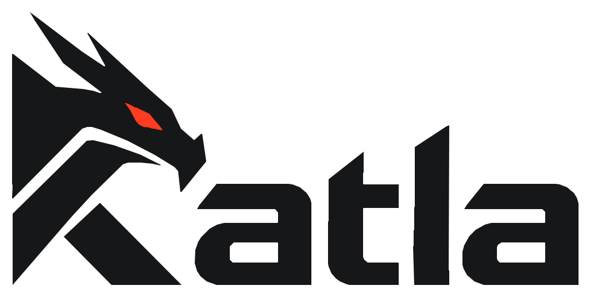

# Katla ✨🎮



A Vulkan/Metal render engine in Rust. A playground for graphics experiments and game development. 🐒

## What's Inside 📦

- **Vulkan 1.3 and native Metal 4** 🔺 - Compiled render graphs, explicit synchronization, frame ownership and bindless resources
- **Custom ECS** 🧩 - Sparse set storage, query system, component derive macros
- **Render graph** 📊 - Resource lifetime management, automatic barrier insertion
- **PBR materials** 💎 - Hot reload support, template-based definitions
- **WGSL shaders** ✨ - Compiled via naga at runtime
- **GLTF support** 🦊 - Skeletal animation, PBR materials, background loading
- **Editor UI** 🖼️ - Declarative dockable panels, asset browser, entity inspector, transform gizmos, CodeEditor with syntect highlighting
- **Bindless textures** 🎨 - Single texture array for UI rendering, texture switching via vertex indices, no push descriptor overhead
- **Text pipeline** 🔤 - cosmic-text with HarfBuzz shaping, BiDi, CJK, word wrapping, font fallback; swash rasterization, etagere atlas packing, subpixel positioning
- **GPU-instanced UI** ⚡ - Instanced rendering (shared unit quad + per-instance data) replaces per-quad vertex emission; incremental Taffy layout caching via dirty flags

## Crates 📚

| Crate | Description |
|-------|-------------|
| `katla_gfx` | Vulkan/Metal GPU core, render graph, materials |
| `katla_ecs` | Entity component system |
| `katla_math` | SIMD math library |
| `katla_ui` | Declarative UI system — Widget trait, focus chains, dockable panels, cosmic-text pipeline, GPU-instanced rendering, CodeEditor |
| `katla_app` | Application framework, components, systems |

## Documentation

Start with the [task-oriented documentation index](docs/README.md). Read
[architecture](docs/architecture.md) for crate boundaries and ownership,
[ECS](docs/ecs.md) for systems, [graphics composition](docs/graphics_core.md) for
rendering, and [editor visual design](docs/editor_ui_design.md) for UI work.
[CI policy](docs/ci.md) and [native Metal evidence](docs/metal4_validation.md)
separate portable checks from physical GPU acceptance. Git/GitHub track delivery
history; [TODO](TODO.md) tracks remaining engineering work.

The progressive [Odin port](odin/README.md) lives under `odin/` on `port/odin`.
Its standalone ECS/editor, math, icons and audio DSP packages can run while the Rust
engine remains the production application and comparison baseline.

## Running 🏃

```bash
cargo run        # Run the demo 🎮
cargo run -- -s  # Limited frames (validation) ✅
cargo test       # Run tests 🧪
```

The `-s` / `--single-frame` flag runs **100 frames**, then exits automatically.
On Arch Linux, install `vulkan-validation-layers` with pacman to enable Khronos
validation in normal runs. Use `cargo run -- -s -v` for GPU-assisted validation.

Vulkan startup requires a Vulkan 1.3 device with graphics and compute on the
same queue, bindless descriptor features, buffer device addresses, and push
descriptors. Windowed rendering also requires swapchain and presentation
support. Selection checks these requirements before ranking devices; if none
qualify, the initialization error lists the rejected devices and their missing
requirements.

## Headless captures

Render the scene and editor without a window (Vulkan on Linux, Metal on macOS):

```bash
cargo run -p game -- --headless -s --screenshot /tmp/katla.png
cargo run -p game -- --ui-test /tmp/katla-ui
cargo run -p game -- --headless -s --scene assets/scenes/playground.katla --screenshot /tmp/playground.png
```

Captures are 2560×1440 PNGs with a 1280×720 logical UI. The UI test captures
five states, including entity selection and Preferences. A Vulkan device and
its driver are required on Linux; no display server is needed. Install the
Khronos validation layer to include Vulkan API checks.

The GPU submission/readback regression test is opt-in:

```bash
cargo test -p katla_gfx --test headless_render -- --ignored
```

## Is this vibecoded? 🤖
**It sure is, I ain't got time to write all of this**  
This repo has become my playground for vibecoding to see how good or bad it can be.

For live scene construction, asset search and PBR material editing, start with
the [agent authoring guide](docs/agent-authoring.md). Preview a room recipe with
`python3 scripts/author_room.py --dry-run`; apply it to a running editor over MCP.
