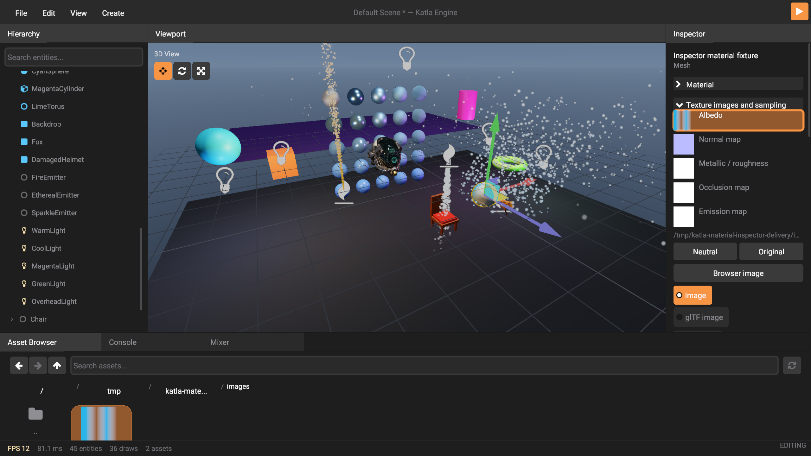
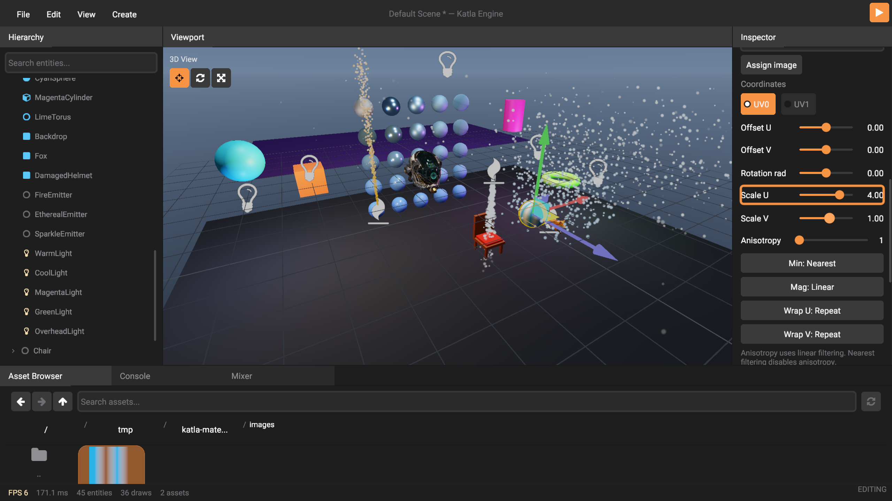
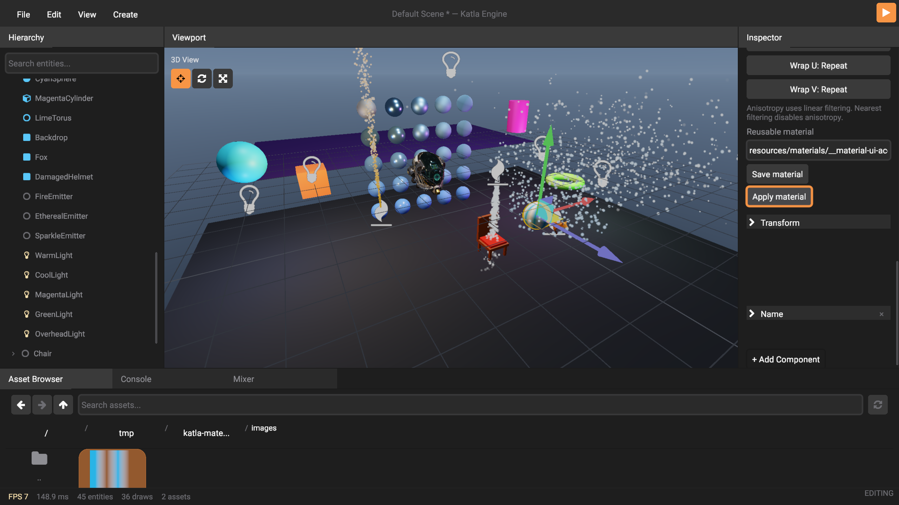

# Native material inspector acceptance

This is historical Rust acceptance at `8b76a167`. It records that source and
its validation scope; current application contracts and commands are in
[the Odin build guide](../odin_build.md) and [editor contract](../odin_editor.md).

The 2026-10-03 Linux/Vulkan walkthrough passes all **23 checks** and captures
27 native frames. [Receipt](receipt.json), [source and binary identity](manifest.json)
and [native log](native.log) preserve the accepted run. All seven new material
frames were visually inspected; three representative frames are retained here.
This is a deterministic UI acceptance run, not an LLM participant study or a
performance benchmark. App test compilation overlapped the native run; incidental
FPS overlays do not establish editor performance.

The runner prepares an owned sphere, a small cyan/white image, selection and
collapsed sections. It locates retained widget bounds, then sends pointer presses,
movement, releases and wheel input through normal declarative hit testing.
The `.katmat` path field is populated as fixture setup; save/apply buttons are
clicked through the UI. The temporary project asset is deleted at completion.

The seven new checks verify image dragging into albedo with untouched factors
and other roles, neutral clearing, original restoration, browser image assignment
and minification changes, held UV dragging outside its row as one undo step,
effective surface capture, and complete material application as one undo step.
Image preview bindings use app-owned live images without adding GPU knowledge
or ownership to the UI crate. Emission without an assigned map previews the
neutral white image used by rendering.

The run also exercises existing hierarchy selection, native picking, preferences,
factor presets/dragging/undo/redo, component addition/removal and prefab Play/Stop.
Component checks now prepare an absent collider, require new history entries,
and scroll controls into view; existing components cannot satisfy an Add check.
The walkthrough exposed separate scroll-coordinate and collider-dependency bugs,
now covered by shared UI and exact collider history regressions.





Reproduce with the editor build:

```bash
cargo build --bin katla --locked
KATLA_MCP_SOCKET=/tmp/katla-material-inspector.sock target/debug/katla --interaction-test /tmp/katla-material-inspector
```

Portable tests check control bounds at 180, 240 and 400 pixels with 1× and 1.5×
font scales. All 404 app, 640 UI and 102 agent tests pass; strict clippy passes
for app/agent/game and UI. Nine native material fixtures separately verify GPU
pixels, image retirement, portable asset relocation, atomic batches and history.
UI receipts and screenshots alone do not prove all PBR rendering behavior; see
[material contracts](https://github.com/Mik-pe/Katla/blob/8b76a167/katla_gfx/src/material/API.md) and
[agent authoring episodes](../material-agent-study/README.md) for those distinct
acceptance scopes. Physical Metal hardware is unavailable here and remains
outstanding native acceptance.
